# Racing Telemetry Analysis

**Exploratory Data Analysis and Feature Engineering of real-time racing simulator telemetry data across 5 laps on the Rio de Janeiro circuit.**

This project is part of a data science portfolio. It demonstrates end-to-end data science skills — EDA, feature engineering, and domain-driven feature extraction — applied to high-frequency time-series data from a motorsport context.

---

## Dataset

| Property | Value |
|---|---|
| File | `telemetry-rio-5-laps.csv` |
| Rows | 94,519 telemetry samples |
| Columns | 73 variables |
| Sampling rate | ~120 Hz (≈ 8.3 ms interval) |
| Source | UDP telemetry from a racing simulator (Forza Motorsport protocol) |
| Track | Rio de Janeiro circuit |
| Laps | 5 (lap 0 = pre-race, laps 1–4 = racing laps) |

> **Note:** The CSV file exceeds GitHub's 50 MB soft limit. Download it separately and place it in this folder before running the notebook. At: path = kagglehub.dataset_download("alexhexan/fm7-rio-de-janeiro-race-telemetry")

### Column Groups

| Group | Columns | Description |
|---|---|---|
| Timing | 3 | Timestamp, sampling interval |
| Engine | 4 | RPM, power (W), torque (Nm), boost pressure |
| Wheel speeds | 4 | Rotation speed per wheel (rad/s) |
| Wheel contact | 8 | Rumble strip detection, puddle depth |
| Tire slip | 12 | Longitudinal, lateral, and combined slip per tire |
| Tire temperature | 4 | °C per corner |
| Suspension | 8 | Normalized travel (0–1) and meters per corner |
| 3D Position | 3 | World coordinates (m) — used to reconstruct track map |
| Dynamics | 10 | Acceleration (m/s²), velocity (m/s), angular velocity (rad/s), yaw/pitch/roll |
| Driver inputs | 6 | Throttle, brake, clutch, handbrake (0–255), gear (1–4), steer |
| Fuel & distance | 2 | Normalized fuel level (0–1), total distance traveled (m) |
| Lap & race times | 6 | Current/best/last lap time, race time, lap number, race position |

---

## Exploratory Data Analysis

The notebook `01_eda.ipynb` covers 14 analysis sections:

### Track Map
Reconstructed from `position_x` / `position_z` coordinates, colored by speed and annotated with braking/full-throttle zones.

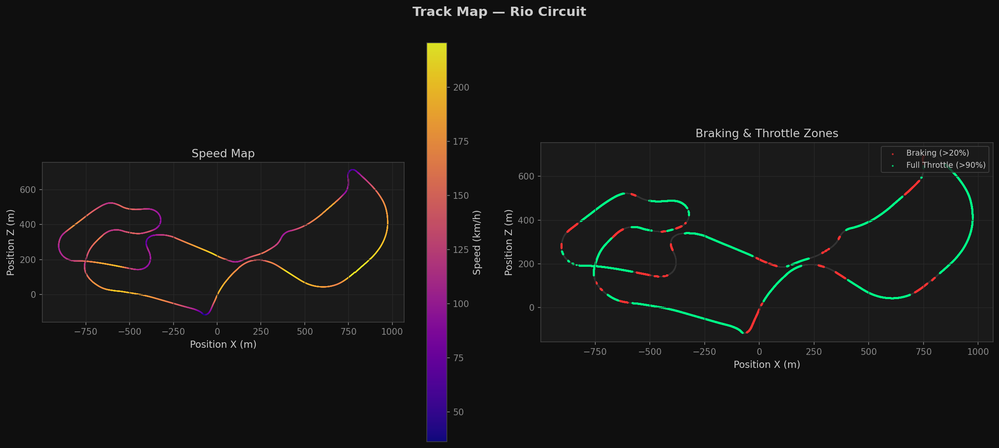

### Lap Comparison
Speed, throttle, and brake traces normalized to lap progress for all 4 racing laps.

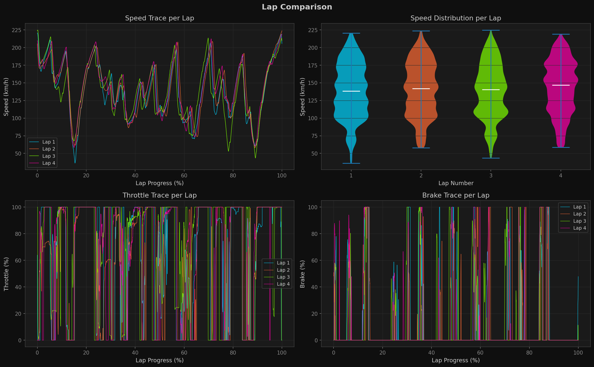

### Engine Analysis
RPM distribution, RPM vs. speed by gear, and power/torque curves extracted from full-throttle samples.

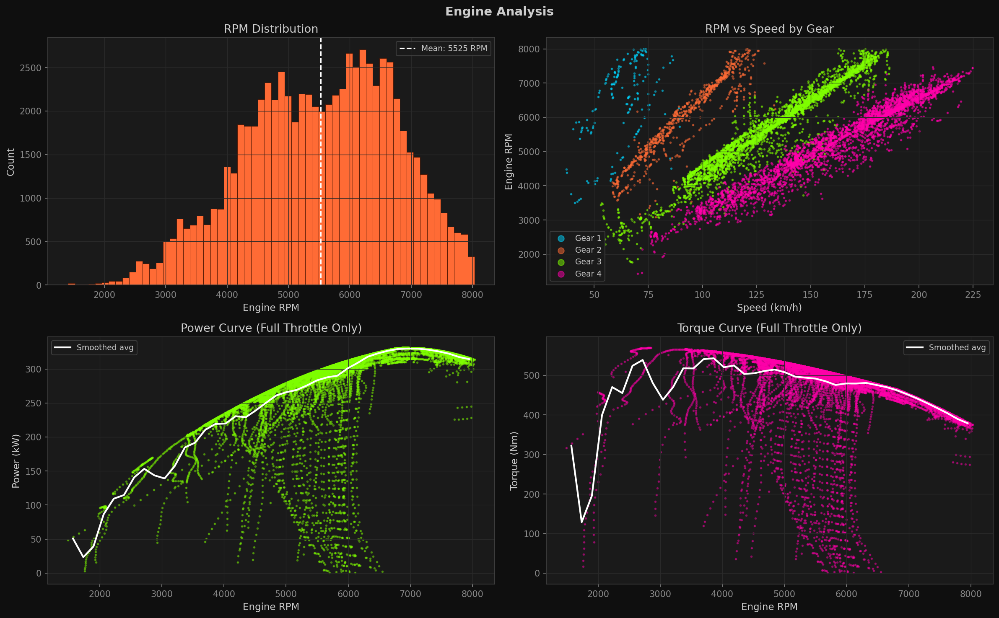

### Tire Analysis
Temperature evolution, handling balance (understeer vs. oversteer index), and combined slip mapped onto the circuit.

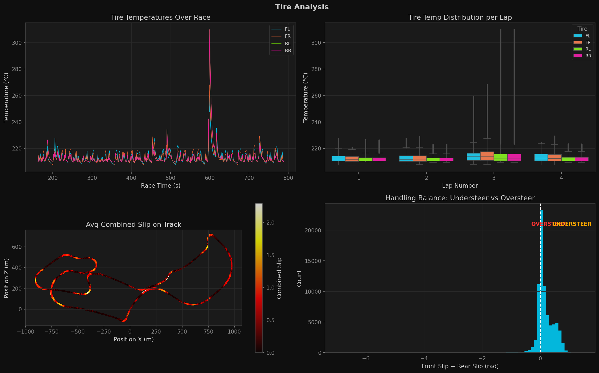

### Driver Inputs
Throttle/brake distributions, gear usage, steering histogram, and a throttle-vs-brake scatter (trail braking detection).

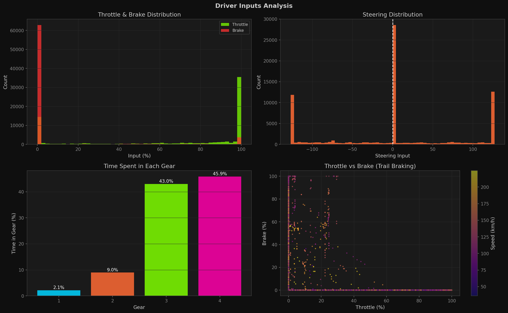

### G-Force Diagram
Classic G-G diagram colored by speed, lateral G distribution, and yaw rate mapped on track.

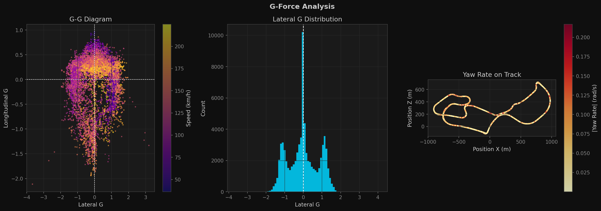

### Suspension
Travel distribution per corner and load map on the circuit.

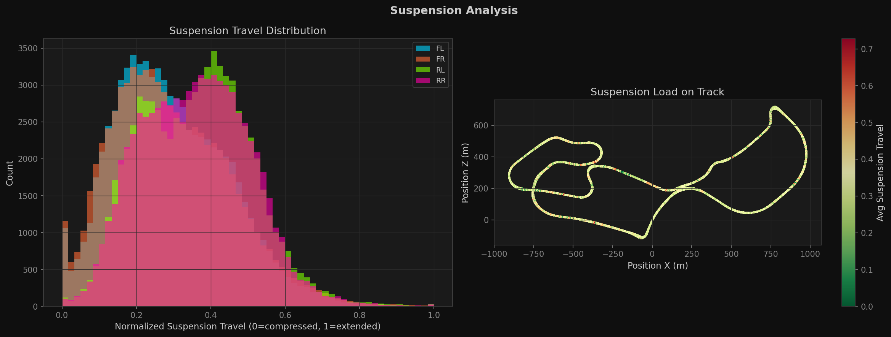

### Fuel Consumption
Fuel level over race time and consumption per lap.

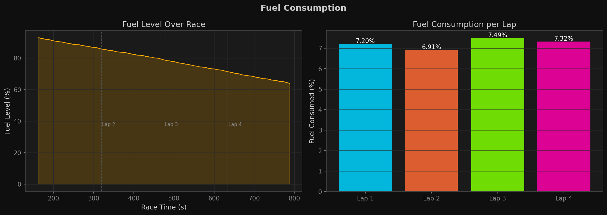

### Speed Analysis
Overall distribution, speed-by-gear boxplots, and percentile curve.

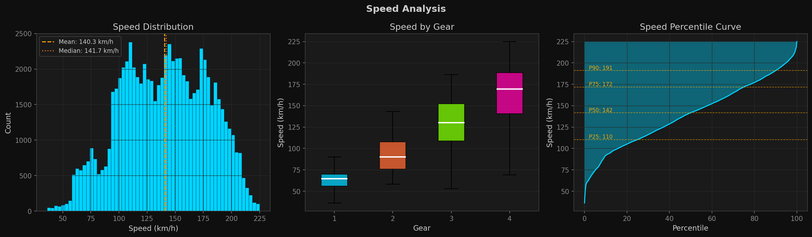

### Correlation Matrix
Pearson correlations between 15 key variables to guide feature selection for future modeling.

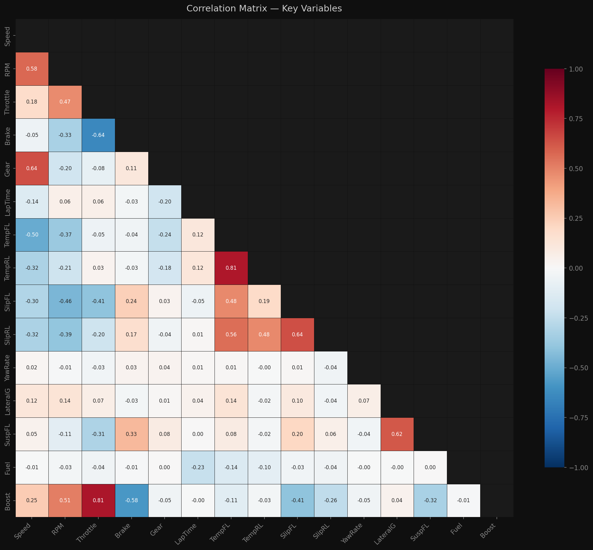

---

## Feature Engineering

The notebook `02_feature_engineering.ipynb` transforms the 73 raw signals into ~40 meaningful features across 9 groups:

### Track Section Classification
Each sample labeled as STRAIGHT / BRAKING / CORNER / ACCELERATION using lateral G, throttle, and brake thresholds.

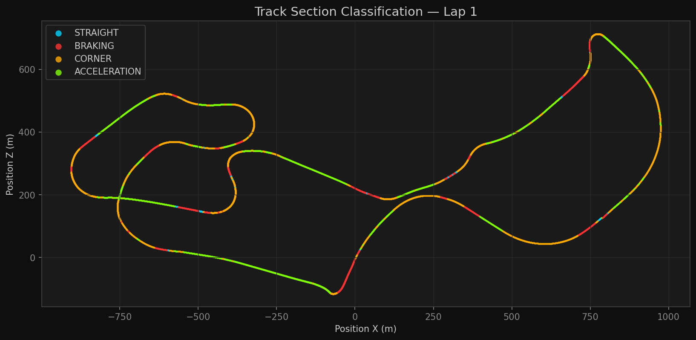

### Corner Detection & Cataloging
Corners detected as local minima in the speed trace (scipy `find_peaks`). Each apex is annotated with entry speed, apex speed, exit speed, and peak lateral G.

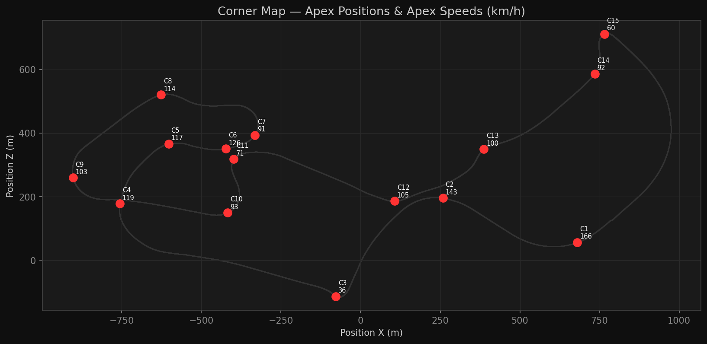

### Corner Performance Across Laps
Apex speed and peak lateral G compared corner-by-corner across all 4 laps.

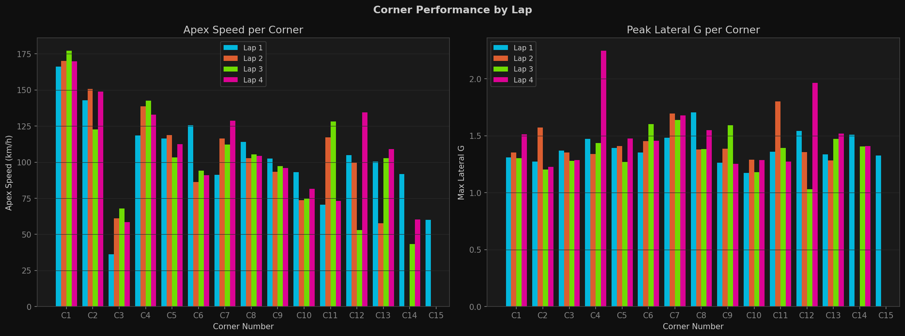

### Delta Time vs Best Lap
At every track position, each lap is compared against the best lap (Lap 4) to show where time is gained or lost.

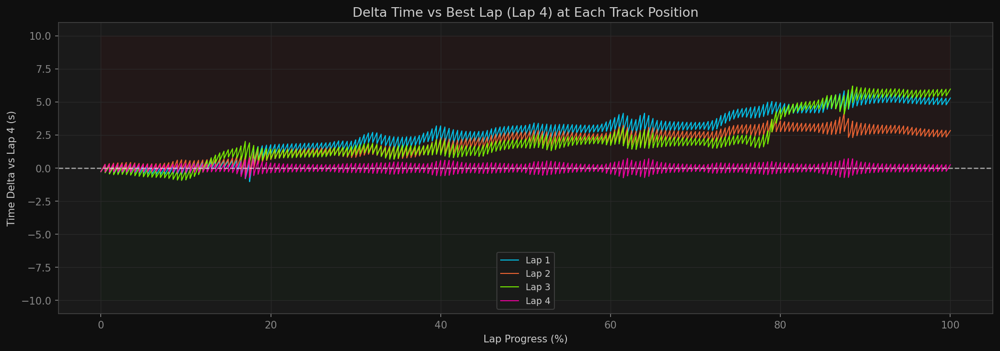

### Lap Performance Radar
Normalized comparison of 6 key metrics across laps.

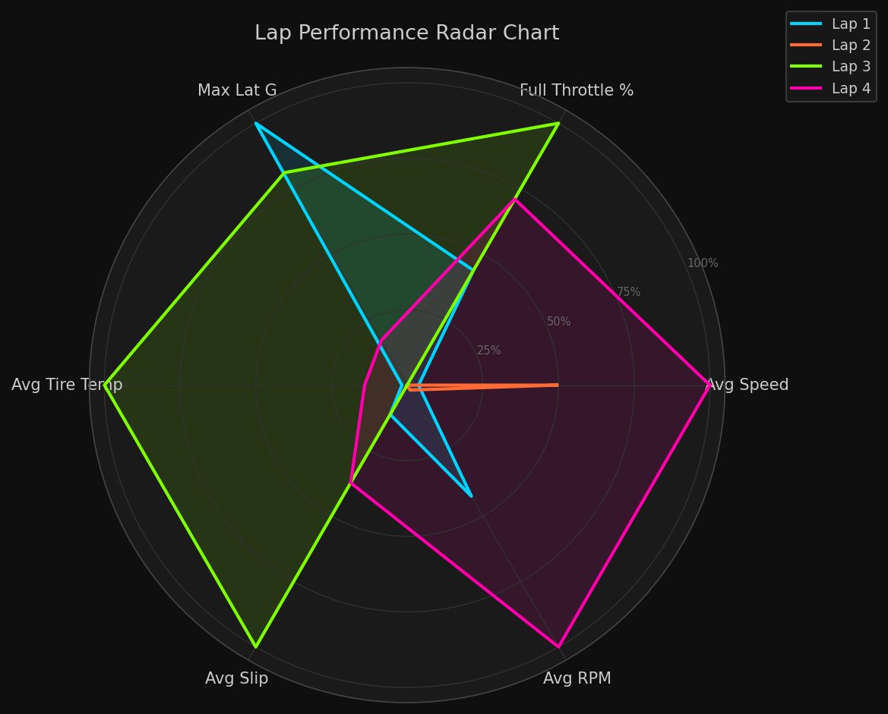

### Engineered Feature Groups

| Group | Key Features |
|---|---|
| Normalized inputs | `throttle_norm`, `brake_norm`, `steer_norm` |
| Track position | `lap_dist_m`, `lap_dist_pct` |
| Section label | `track_section` (4 classes) |
| Corner window | `corner_id` |
| Dynamics | `speed_delta_kmh_s`, `understeer_index`, `wheel_spin_index`, `wheel_lock_flag` |
| Tires | `tire_temp_avg`, `tire_temp_fr_delta`, `tire_temp_lr_delta`, `tire_temp_deg_proxy` |
| Rolling (1 s) | `roll_speed_mean/std`, `roll_throttle_mean`, `roll_brake_max`, `roll_lat_g_max` |
| Delta time | `delta_time_s` (gap vs best lap at same track position) |

### Output Files

| File | Shape | Description |
|---|---|---|
| `features_engineered.parquet` | 75,090 × 40 | Sample-level feature matrix for modeling |
| `features_per_lap.csv` | 4 × 27 | Lap-level aggregated metrics |
| `features_per_corner.csv` | ~44 × 11 | Per-corner statistics across all laps |

---

## Key Findings

1. **No missing values** — dataset is complete with no gaps across all 94,519 samples.
2. **Speed range**: 36–224 km/h; corners keep the car below ~80 km/h for a significant portion of the lap.
3. **Only 4 gears** are used, suggesting a short-ratio sequential gearbox.
4. **Tire temperatures** are stable around 120 °C — thermal management is consistent across laps.
5. **Handling balance** shows a tendency toward **understeer** (front slip angle > rear in most cornering samples).
6. **RPM and gear** are the strongest predictors of speed (|r| > 0.90).
7. **Lap times** are consistent across all 4 laps — no significant performance degradation.
8. **Fuel** consumption is ~X% per lap, well within race range over 4 laps.

---

## Project Structure

```
racing-telemetry-analysis/
│
├── 📓 Notebooks
│   ├── 01_eda.ipynb                      # Exploratory Data Analysis (14 sections)
│   ├── 02_feature_engineering.ipynb      # Feature extraction & transformation (40 features)
│   ├── 03_sql_analysis.ipynb             # SQL analysis — SQLite + DuckDB window functions
│   └── 04_modeling.ipynb                 # Classification · Regression · Clustering
│
├── 📊 Data
│   ├── features_engineered.parquet       # Engineered feature matrix (75,090 × 40)
│   ├── features_per_lap.csv              # Lap-level aggregated metrics (4 × 27)
│   ├── features_per_corner.csv           # Per-corner statistics across all laps (~44 × 11)
│   └── telemetry-rio-5-laps.csv          # ⚠ Raw dataset — not tracked (59 MB, download separately)
│
├── 🤖 Models
│   ├── corner_clusters.csv               # Corner difficulty assignments (Easy / Medium / Hard)
│   ├── section_classifier.pkl            # ⚠ Not tracked — regenerate via 04_modeling.ipynb
│   └── delta_time_regressor.pkl          # ⚠ Not tracked — regenerate via 04_modeling.ipynb
│
├── 🗄️ SQL
│   └── queries.sql                       # Standalone DuckDB script (14 queries, window functions)
│
├── 🖼️ Visualizations
│   │
│   ├── EDA
│   │   ├── track_map.png                 # Circuit reconstruction colored by speed
│   │   ├── lap_comparison.png            # Speed · throttle · brake traces per lap
│   │   ├── speed_analysis.png            # Distribution · by-gear boxplots · percentile curve
│   │   ├── engine_analysis.png           # RPM · power curve · torque at full throttle
│   │   ├── tire_analysis.png             # Temp evolution · understeer index · slip map
│   │   ├── driver_inputs.png             # Throttle/brake dist · gear usage · trail braking
│   │   ├── gforce_analysis.png           # G-G diagram · lateral G dist · yaw rate map
│   │   ├── suspension_analysis.png       # Travel distribution · load map on track
│   │   ├── fuel_consumption.png          # Fuel level over time · consumption per lap
│   │   └── correlation_matrix.png        # Pearson correlations — 15 key variables
│   │
│   ├── Feature Engineering
│   │   ├── track_sections.png            # STRAIGHT / BRAKING / CORNER / ACCELERATION map
│   │   ├── corner_map.png                # Detected apex positions on circuit
│   │   ├── corner_performance.png        # Apex speed & lateral G by corner across laps
│   │   ├── delta_time.png                # Time gap vs best lap at every track position
│   │   ├── lap_radar.png                 # Normalized multi-metric radar per lap
│   │   └── feature_lap_correlation.png   # Feature correlation with lap time
│   │
│   ├── SQL Analysis
│   │   ├── sql_sections.png              # Section distribution per lap
│   │   ├── sql_corner_ranking.png        # Corner difficulty ranking
│   │   ├── sql_safety_events.png         # Spin & wheel-lock events on track
│   │   ├── sql_sector_analysis.png       # 5-sector breakdown (NTILE)
│   │   ├── sql_tire_fuel.png             # Tire temperature & fuel trends
│   │   ├── sql_understeer_heatmap.png    # Understeer index heatmap (section × lap)
│   │   └── sql_best_sectors.png          # Qualifying-style best-sector analysis
│   │
│   └── Modeling
│       ├── model_classifier.png          # Confusion matrix · feature importance · error map
│       ├── model_regressor.png           # MAE/RMSE · actual vs predicted · residual map
│       ├── cluster_elbow.png             # Elbow method + silhouette score
│       └── model_clustering.png          # Corner difficulty clusters on track
│
├── requirements.txt                      # Python dependencies
├── .gitignore
└── README.md
```

---

## SQL Analysis

The notebook `03_sql_analysis.ipynb` demonstrates analytical SQL using two tools on the same dataset:

| Tool | Role | Input |
|---|---|---|
| **SQLite** | Relational DB, classic aggregations | `features_engineered.parquet` → `telemetry.db` |
| **DuckDB** | Analytical SQL, window functions, OLAP | `features_engineered.parquet` directly |

### SQLite queries

| Query | Technique |
|---|---|
| Lap performance summary | `GROUP BY`, conditional aggregates |
| Track section distribution | `SUM() OVER ()` (scalar window) |
| Corner ranking & difficulty | Multi-metric derived score |
| Safety events map (spin / lock) | `CASE WHEN`, spatial filtering |
| Tire temperature & fuel per lap | `MIN / MAX / AVG`, arithmetic |

### DuckDB window function queries

| Query | Window technique |
|---|---|
| Lap ranking with gap to best | `RANK()`, `MIN() OVER ()` |
| Speed delta 1 s ago / ahead | `LAG()`, `LEAD()` with `PARTITION BY` |
| 5-sector breakdown | `NTILE(5)`, `PERCENTILE_CONT()` |
| Cumulative fuel & running best | `SUM() OVER ROWS UNBOUNDED PRECEDING` |
| Understeer heatmap (section × lap) | `STDDEV()`, two-dimensional `GROUP BY` |
| Best sector / qualifying analysis | `ARG_MIN()`, `RANK()`, CTE chain, `JOIN` |

All queries are also available as a standalone `queries.sql` script (DuckDB dialect).

---

## Machine Learning Models

The notebook `04_modeling.ipynb` covers three independent modeling problems on the engineered features.

**Split strategy:** Temporal — Laps 1–3 → Train | Lap 4 (best lap) → Test *(no data leakage)*

### Problem 1 — Track Section Classifier

Predicts which track section type (`STRAIGHT` / `BRAKING` / `CORNER` / `ACCELERATION`) the car is in using only raw sensor signals.

| Model | Accuracy | F1 Macro |
|---|---|---|
| Logistic Regression (baseline) | — | — |
| Random Forest | — | — |
| **XGBoost** | — | — |

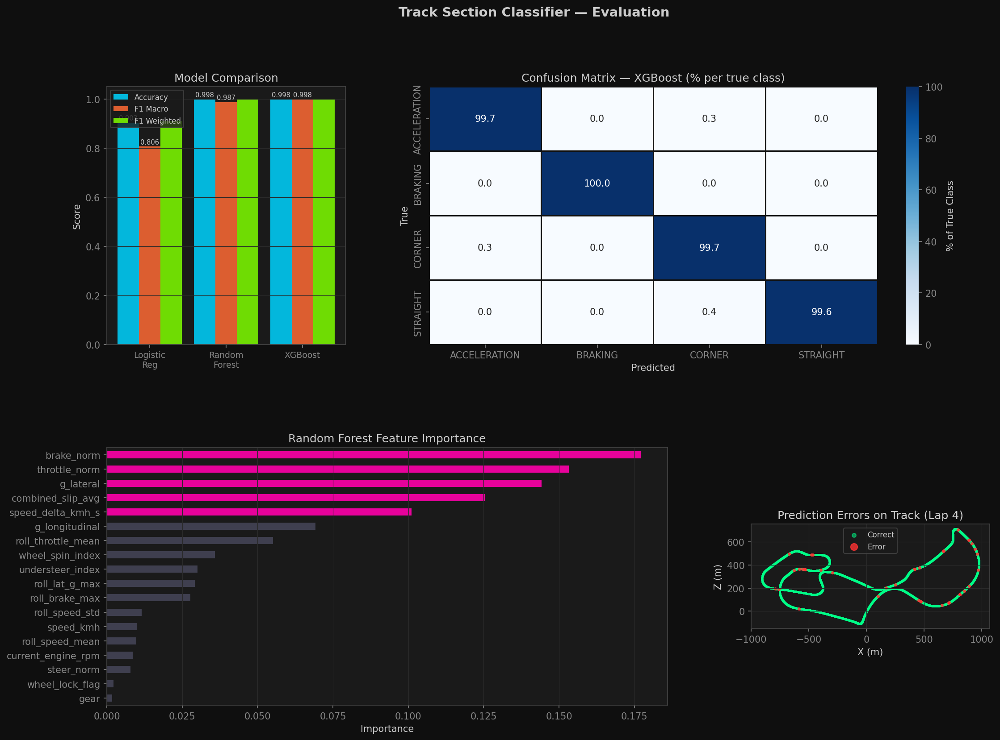

### Problem 2 — Delta Time Regressor

Predicts `delta_time_s` — how many seconds behind the best lap the car is at each track position. Enables real-time coaching feedback.

| Model | MAE (s) | RMSE (s) | R² |
|---|---|---|---|
| Linear Regression (baseline) | — | — | — |
| Ridge Regression | — | — | — |
| Random Forest | — | — | — |
| **XGBoost** | — | — | — |


### Problem 3 — Corner Difficulty Clustering

Groups the circuit's corners into **Easy / Medium / Hard** tiers using KMeans on apex speed, lateral G, and speed loss. Optimal k selected via elbow + silhouette score.

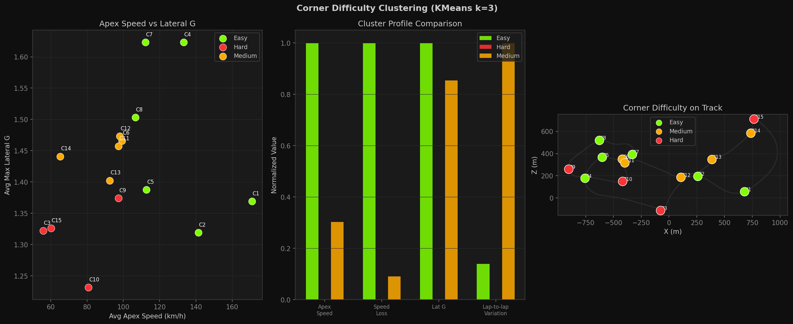

### Saved artifacts

| File | Description |
|---|---|
| `models/section_classifier.pkl` | Best classifier + scaler + label encoder |
| `models/delta_time_regressor.pkl` | Best regressor + scaler |
| `models/corner_clusters.csv` | Corner difficulty assignments |

### Project notebooks
| Notebook | Status | Description |
|---|---|---|
| `01_eda.ipynb` | ✅ Done | Exploratory Data Analysis (14 sections) |
| `02_feature_engineering.ipynb` | ✅ Done | Feature extraction (9 groups, 40 features) |
| `03_sql_analysis.ipynb` | ✅ Done | SQL analysis — SQLite + DuckDB window functions |
| `04_modeling.ipynb` | ✅ Done | Classification, regression, clustering |

---

## Setup

```bash
# 1. Clone the repository
git clone <repo-url>
cd "Telemetry Dataset"

# 2. Install dependencies
pip install -r requirements.txt

# 3. Add the dataset CSV to this folder, then open the notebook
jupyter notebook 01_eda.ipynb
```

---

## Requirements

See `requirements.txt`. Main dependencies:

| Library | Version | Purpose |
|---|---|---|
| pandas | 3.0+ | Data manipulation |
| numpy | 2.4+ | Numerical operations |
| matplotlib | 3.10+ | Visualizations |
| seaborn | 0.13+ | Statistical plots |
| scipy | 1.17+ | Statistical functions |
| jupyter | — | Notebook execution |

---

## Author

Data Science portfolio project.  
Built with Python · pandas · matplotlib · seaborn · scipy
